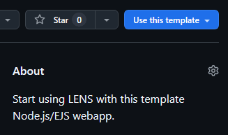

# LENS App

This is a template Node.js web application that demonstrates how to use LENS for authentication.

## Prerequisites

- Node.js (v14 or higher)
- npm (v6 or higher)

## Installation

1. Clone the repository:

    ```sh
    git clone https://github.com/LENSAuth/my-app.git
    cd my-app
    ```

   - 1a. Use as template:

       To instead use this repository as a template for new projects, click the "Use this template" button on [the GitHub repository](https://github.com/LENSAuth/my-app), or click this link: [Create a new repository](https://github.com/new?template_name=my-app&template_owner=LENSAuth).

       

2. Install all dependencies:

    ```sh
    npm install
    ```

## Running the App

1. Start the server:

    ```sh
    node index.js
    ```

2. Open your browser and navigate to `http://localhost:8080`.

## Project Structure

- `index.js`: Main server file that sets up the Express app and handles routes.
- `views/index.ejs`: EJS template file for rendering the main page.
- `.gitignore`: Specifies files and directories to be ignored by Git.
- `package.json`: Contains project metadata and dependencies.

## Usage

### GET Request

- When you navigate to `http://localhost:8080`, the server will render the `index.ejs` file and display "Hello World!".

### POST Request

- The app listens for POST requests at the root URL (`/`). When a POST request is received, it logs the request body to the console and responds with a JSON message.

### Popup Window

- The `index.ejs` file includes a script that opens a popup window to `https://lens.admin-host.com` and listens for messages from this origin.
- When a message is received from the popup, it is logged to the console and displayed on the page.
- The message is also sent to the server via a POST request.

## Notes

- Ensure that the domain you are using is registered with LENS. For testing purposes, you can register `localhost`.
- The server logs the status and received data to the console.

## License

This project is licensed under the MIT License.
